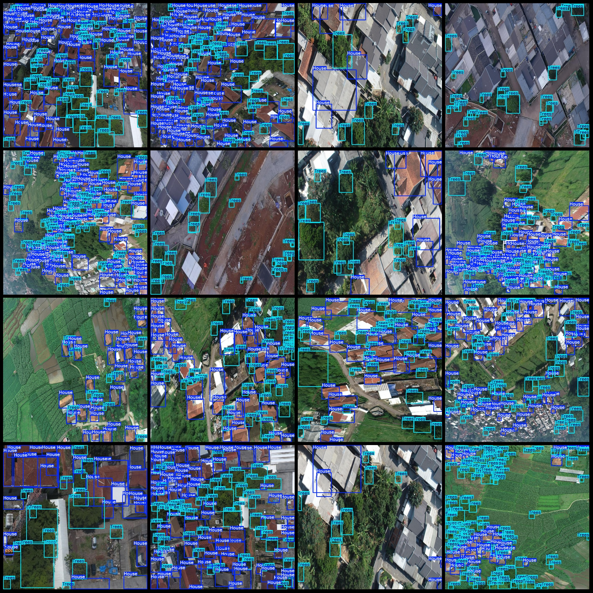
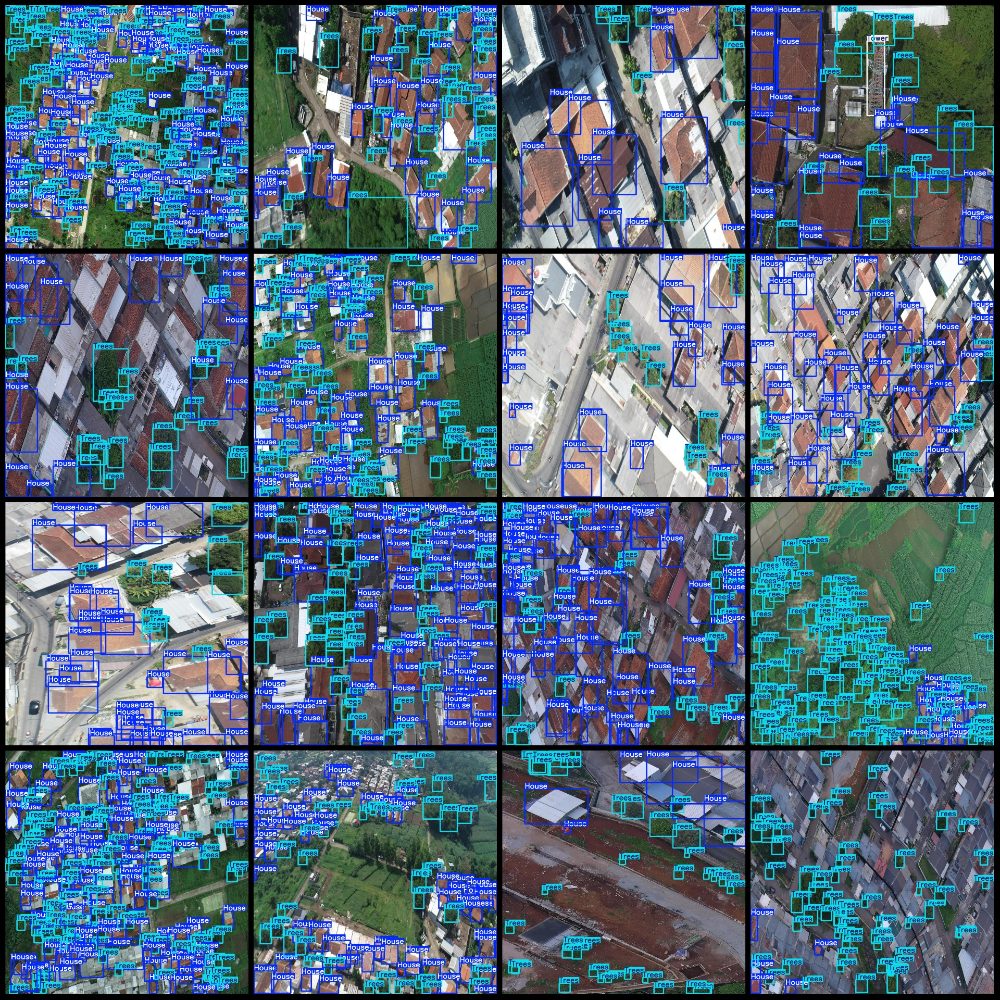

# UAV Perspective Urban Residential Area Buildings, Towers, Trees Detection Dataset VOC+YOLO Format with 2476 Images in 3 Categories

Dataset format: Pascal VOC format + YOLO format (without split path txt files, only containing jpg images along with corresponding VOC format xml files and yolo format txt files)
Number of images (number of jpg files): 2476
Number of annotations (number of xml files): 2476
Number of annotations (number of txt files): 2476
Number of annotation categories: 3
Annotation category names (note that the order of categories in the yolo format is not consistent with this, but refer to the labels folder's classes.txt for consistency): ["House", "Tower", "Trees"]
Number of bounding boxes per category:
House (houses) bounding box count = 118720
Tower (towers) bounding box count = 314
Trees (trees) bounding box count = 140277
Total bounding box count: 259311
Image resolution: 1024x1024
Annotation tool used: labelImg
Annotation rules: Draw bounding boxes for each category
Important note: The dataset does not have a separate training/validation/test set; you will need to divide it yourself.
Special notice: This dataset does not guarantee any accuracy in training models or weight files.
Image preview:
Annotation example:

## Images

Here is a pay link on Stripe ( https://buy.stripe.com/3cs8yP7sY87d0vu9AB ). Please contact me lonlonago@foxmail.com after funding $89, and I will send you a complete data files , thank you!

